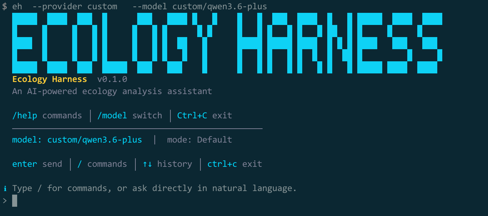

# Ecology Harness

[English](README.md) | [简体中文](README.zh-CN.md)

Ecology Harness 是一个面向生态、环境与农业生态研究工作流的 Python Agent Harness。当前项目已经内置了一批不断增长的生态能力包，包括面向不同子方向的 skills、可发现的 MCP 目录，以及用于文献检索、空间分析、水体微宇宙、光生物反应器、生物多样性观测、显微图像和多模态分析的实用 tools。

项目希望在保持通用 Harness 内核稳定的同时，把生态领域的扩展面做得越来越丰富，让新的 skills、MCP servers 和 tools 能持续叠加而不把核心运行时搞乱。也非常欢迎大家一起参与补充和完善，共同把这个生态领域的能力栈做得更完整。

## 启动界面



## 项目包含的能力

- 模块化包结构，便于后续持续扩展
- CLI + REPL 双入口，支持自然语言与 slash command 混合使用
- 事件驱动的终端交互界面
- Agent loop 与工具调用闭环
- 统一的模型 provider 抽象层，兼容本地与远端后端
- 内置支持 `mock`、`anthropic`、`openai`、`openrouter`、`gemini`、`kimi`、`qwen`、`zhipu`、`deepseek`、`ollama`、`lmstudio`、`custom`
- 会话持久化、恢复与上下文压缩
- 可配置 Sandbox、权限策略与审计
- 工具注册系统与内置通用工具
- 支持本地图片、音频、文档与视频抽帧附件的多模态输入
- 内置文档分析工具，可处理 `pdf`、`docx`、`md`、`csv`、`json`、`html`、`ipynb`
- 双 scope 记忆系统与自动 `MEMORY.md`
- 多智能体与子智能体协同机制
- Markdown skill 系统
- MCP 与 plugin 扩展骨架
- 来自高质量上游仓库的生态技能包
- 面向农业、环境、生态场景的 MCP 目录
- 封闭藻类系统 / 光生物反应器 skills 与实验分析型 MCP 目录
- 标准库 `unittest` 测试集

## Ecology Pack

当前仓库已经内置了一组经过筛选的生态能力包，包括在线 skill bundle 和可发现的 MCP server 配置。

目前最适合用“子方向地图”的方式来看这批能力：

| 子方向 | 典型研究任务 | 已有 Skill | 已有 MCP / Tool |
|---|---|---|---|
| 文献检索与证据综合 | 综述、引文扩展、证据简报、综述识别、研究版图扫描 | `ecology-evidence-synthesis`<br>`literature-multi-source-search`<br>`open-access-paper-harvest`<br>`expand-references`<br>`trace-citations`<br>`paper-triage` | `semantic-scholar`<br>`openalex-research`<br>`scientific-papers`<br>`simple-pubmed`<br>`crossref`<br>`unpaywall` |
| 个体、种群与群落生态 | 胁迫响应、种群扩张、入侵扩散、共存机制、扰动响应 | `organismal-stress-screen`<br>`population-invasion-screen`<br>`community-assembly-review` | `openalex-research`<br>`gbif`<br>`simple-pubmed`<br>`scientific-papers` |
| 生物多样性与物种分布 | 物种信息、occurrence、采样偏差、栖息地预筛查 | `biodiversity-data-triage`<br>`species-occurrence-workbench` | `gbif`<br>`gis-mcp`<br>`stac` |
| 物种识别与野外观测 | 从照片识别植物、规范 taxon、查看观测背景 | `species-photo-identification` | `PlantNetIdentify`<br>`INaturalistSearchTaxa`<br>`INaturalistSearchObservations`<br>`pyinaturalist`<br>`Pl@ntNet API`<br>`pybioclip` |
| 空间生态与遥感 | NDVI、土地覆盖、影像筛查、栅格规划、目录选择、连通性 | `spatial-ecology-raster-lab`<br>`remote-sensing-catalog-hunt`<br>`landscape-connectivity-screen`<br>`mapbox-geospatial-operations` | `stac`<br>`gis-mcp`<br>`nasa`<br>`mapbox` |
| 气候、天气与空气质量 | 干旱、热浪、降水、空气质量、气候信号、季节预测 | `agri-climate-screen`<br>`global-change-ecology-brief`<br>`open-meteo`<br>`open-meteo-advanced` | `weather-open-meteo`<br>`nasa`<br>`gis-mcp` |
| 水文与淡水环境 | 水位、流量、洪水背景、流域预筛查 | `hydrology-and-flood-screen`<br>`environmental-site-screen` | `weather-open-meteo`<br>`swiss-environment`<br>`noaa-tides-currents` |
| 海岸、河口、湿地与蓝碳 | 潮位、海平面、沿海洪水、湿地选址预筛查 | `coastal-ecology-screen` | `noaa-tides-currents`<br>`nasa`<br>`weather-open-meteo` |
| 农业生态与农业环境 | 作物系统筛查、气候胁迫、景观背景 | `agri-climate-screen` | `weather-open-meteo`<br>`nasa`<br>`mapbox`<br>`gis-mcp` |
| 淡水微宇宙、浮游群落与生物膜 | 摄食微宇宙、浮游变化、底栖生物膜、水质、荧光、显微分类 | `aquatic-microcosm-foodweb-design`<br>`zooplankton-grazing-and-plankton-dynamics`<br>`benthic-biofilm-and-periphyton-monitoring`<br>`water-quality-and-nutrient-panel`<br>`plankton-microscopy-and-auto-classification`<br>`fluorescence-spectra-and-molecular-assays` | `jupyter-mcp`<br>`influxdb3`<br>`labarchives`<br>`unit-converter`<br>`scientific-papers`<br>`openalex-research`<br>`simple-pubmed`<br>`pubchem` |
| 封闭藻类系统与光生物反应器 | 封闭反应器设计、光径、pH / CO2 控制、污染排查、生长曲线、物质平衡 | `closed-algae-system-design`<br>`photobioreactor-environment-control`<br>`microalgae-strain-and-inoculation`<br>`algal-monitoring-plan`<br>`photobioreactor-troubleshooting`<br>`algal-timeseries-and-mass-balance` | `jupyter-mcp`<br>`influxdb3`<br>`labarchives`<br>`unit-converter`<br>`scientific-papers`<br>`openalex-research`<br>`pubchem` |
| 植物表型与性状提取 | 叶片性状、形态测量、腊叶标本测量、器官检测 | `plant-phenotyping-and-traits` | `PlantCV`<br>`LeafMachine2` |
| 生态计数与分割 | 植株计数、树木计数、动物检测、树冠分割 | `ecology-counting-and-segmentation` | `DeepForest`<br>`detectree2`<br>`TreeCountSegHeight`<br>`PyTorch-Wildlife` |
| 生态系统生物地球化学与土壤系统 | 碳、甲烷、养分循环、土壤健康、修复背景 | `ecosystem-biogeochemistry-workup`<br>`soil-health-and-nutrient-screen` | `weather-open-meteo`<br>`nasa`<br>`eosc-data-commons`<br>`dataverse`<br>`wsl-envidat` |
| 环境化学与暴露 | 污染物、PFAS、微塑料、农药归趋、毒理交叉文献 | `environmental-chemistry-risk-scan`<br>`literature-multi-source-search` | `pubchem`<br>`simple-pubmed`<br>`scientific-papers`<br>`weather-open-meteo`<br>`swiss-environment` |
| 微生物生态与保育遗传 | 分类、marker、组装、直系同源、BLAST 工作流 | `microbial-ecology-sequence-workflow` | `ncbi-datasets`<br>`bio-blast`<br>`simple-pubmed` |
| 生态声学 | 鸟声识别、被动声学筛查、批量音频回顾 | `ecoacoustics-screen` | `BirdNET-Analyzer` |
| 保护与恢复 | 恢复预筛查、生态压力、场地背景 | `environmental-site-screen`<br>`ecology-evidence-synthesis` | `mapbox`<br>`gis-mcp`<br>`nasa` |
| 开放数据与科研仓储 | 数据集发现、DOI 级数据记录、复现材料 | `research-data-repository-hunt`<br>`ecology-dataset-hunt` | `dataverse`<br>`eosc-data-commons`<br>`wsl-envidat` |
| 区域公共环境数据 | 区域环境监测和公开研究数据 | `swiss-environment-brief` | `swiss-environment`<br>`wsl-envidat` |
| 制图与地图表达 | 地图设计、视觉层级、报告制图 | `mapbox-cartography`<br>`mapbox-data-visualization-patterns` | `mapbox` |

可以直接查看：

```bash
eh skills
eh mcp
```

当前版本里的 MCP 状态含义：

- `connected`：当前就是可直接工作的 in-process server
- `configured`：已经启用，但依赖远端 transport
- `cataloged`：元数据已经装进仓库，后续 transport 接上即可启用

上游来源说明见 [docs/ecology-pack.zh-CN.md](docs/ecology-pack.zh-CN.md)。

封闭藻类系统与光生物反应器相关能力说明见 [docs/algae-photobioreactor-pack.zh-CN.md](docs/algae-photobioreactor-pack.zh-CN.md)。

淡水微宇宙、浮游群落和生物膜相关能力说明见 [docs/aquatic-microcosm-pack.zh-CN.md](docs/aquatic-microcosm-pack.zh-CN.md)。

可以直接这样试：

```bash
eh prompt '/closed-algae-system-design flat-panel Chlorella reactor for wastewater polishing'
eh prompt '/photobioreactor-environment-control CO2 and pH control for sealed Spirulina cultivation'
eh prompt '/algal-timeseries-and-mass-balance interpret pH, dissolved oxygen, and nitrate drawdown in a batch reactor'
eh prompt '/aquatic-microcosm-foodweb-design Daphnia Chlorella Microcystis Navicula freshwater microcosm'
eh prompt '/plankton-microscopy-and-auto-classification microscope camera workflow for Daphnia rotifers and algal colonies'
```

这一轮还进一步补齐了更细粒度的研究方向：

- 个体胁迫与生理生态
- 种群、入侵与元种群筛查
- 群落组装与扰动响应
- 生态系统碳、甲烷与养分循环
- 景观连通性与遥感目录选择
- 全球变化生态与气候风险
- 微生物生态、eDNA 邻近工作流与保育遗传
- 环境化学、污染物归趋与毒性筛查

## Ecology 基础工具层

当前仓库还新增了一层“生态观测与视觉基础工具”：

- 轻量原生工具：taxon / observation 查询
- 原生植物识别：通过 Pl@ntNet API
- 外部重型工具目录：表型、计数、分割、相机陷阱、生态声学

完整功能树见 [docs/ecology-basic-tools.zh-CN.md](docs/ecology-basic-tools.zh-CN.md)。

当前这个工具目录也已经纳入实验室和生物过程分析相关项，例如
`Jupyter MCP Server`、`InfluxDB 3 MCP Server`、`LabArchives MCP Server`、
`unit-converter-mcp`、`PyLabRobot` 和 `Opentrons`。

现在也纳入了显微图像、浮游生物和分子分析相关工具，例如
`Fiji / ImageJ`、`PyImageJ`、`CellProfiler`、`napari`、`ilastik`、
`EcoTaxa Python Client`、`PlanktoScope`、`QIIME 2 / Rachis Framework` 和 `DADA2`。

可以直接查看：

```bash
eh tool ListEcologyFunctions '{}'
eh tool ListEcologyToolkits '{}'
eh tool DescribeEcologyToolkit '{"name":"plantcv"}'
eh tool INaturalistSearchTaxa '{"query":"Quercus alba"}'
eh tool INaturalistSearchObservations '{"taxon_name":"Quercus alba","per_page":3}'
```

如果你有 Pl@ntNet API key：

```bash
export PLANTNET_API_KEY=your_key_here
eh tool PlantNetIdentify '{"image_paths":["leaf.jpg"],"organs":["leaf"]}'
```

## 多模态与文档分析

当前运行时已经支持把本地图片、音频、文档与视频带进主对话链路：

- 图片附件会按支持视觉输入的 provider 发送为真正的多模态内容块
- 音频附件在 OpenAI provider 上会按原生音频输入发送，其它 provider 暂时退化为带元数据的上下文
- 文档附件会先做规范化提取，在支持原生文件输入的 provider 上走更合适的格式，其余 provider 退化为纯文本分析
- 视频附件会在本地先抽取多帧图像，再进入分析链路
- REPL 的附件交互参考了 `claw-code`，支持 `/attach`、`/image`、`/audio`、`/video`、`/doc`、`/attachments`

可以直接这样使用：

```bash
# 附带本地图片
eh --provider openai --model gpt-4o --attach imgs/specimen.jpg \
  "识别这个物种，并说明你判断时看到的关键特征"

# 附带本地报告或论文
eh --attach docs/wetland_report.pdf \
  "总结这个报告的方法、主要发现，以及对湿地修复的启示"

# 附带本地音频
eh --provider openai --model gpt-4o-audio-preview --attach audio/birdsong.wav \
  "识别可能的鸟种，并描述鸣叫节律"

# 附带本地视频；框架会先抽取多帧图像供分析
eh --attach video/camera_trap.mp4 \
  "基于采样帧描述这个相机陷阱视频中的动物活动"

# 不走模型，直接做文档检查/提取
eh tool DocumentInspect '{"path":"docs/wetland_report.pdf"}'
eh tool DocumentExtract '{"path":"notes/field_log.docx","max_chars":12000}'
eh tool AudioInspect '{"path":"audio/birdsong.wav"}'
eh tool VideoInspect '{"path":"video/camera_trap.mp4"}'
eh tool VideoSampleFrames '{"path":"video/camera_trap.mp4","frame_count":6}'
```

在 REPL 中：

```text
/attach docs/wetland_report.pdf
/image imgs/specimen.jpg
/audio audio/birdsong.wav
/video video/camera_trap.mp4
/attachments
总结这些附件里的关键信息
```

## 快速开始

### 一键安装

```bash
bash scripts/install.sh
```

带开发依赖：

```bash
bash scripts/install.sh --with-dev
```

如果你更习惯 `uv`：

```bash
bash scripts/install.sh --uv
```

### 从源码安装

```bash
git clone <your-repo-url>
cd EcologyHarness

python3 -m venv .venv
source .venv/bin/activate

python3 -m pip install --upgrade pip setuptools wheel
python3 -m pip install -e .

# 可选：安装开发依赖
python3 -m pip install -e '.[dev]'
```

也可以使用 `uv`：

```bash
uv sync
uv run eh --help
```

安装完成后，推荐直接使用：

```bash
eh --help
```

`eh` 是推荐入口；`ecology-harness` 与 `python3 -m ecology_harness` 仍然可用。

如果暂时不想安装，也可以直接源码运行：

```bash
PYTHONPATH=src python3 -m ecology_harness --help
```

## 运行示例

```bash
# 查看状态
eh status

# 查看内置工具
eh tools

# 查看插件与 MCP
eh plugins
eh mcp

# 查看支持的模型来源
eh providers

# 直接使用 OpenRouter
export OPENROUTER_API_KEY="sk-or-..."
eh --provider openrouter --model openai/gpt-4.1-mini \
  "summarize this repository in 5 bullets"

# 查看生态技能
eh skills

# 直接进入 REPL
eh repl

# 单轮 prompt
eh "summarize this repository in 5 bullets"

# 显式 prompt 命令
eh prompt '/tool Read {"path":"README.md"}'

# 带本地附件的多模态 prompt
eh --attach docs/wetland_report.pdf prompt "summarize this report"

# 恢复最近一次会话
eh --resume latest repl
```

默认情况下，`--prompt` 和 `--repl` 会显示中间 trace，包括步骤、工具调用和结果摘要。可以用 `--quiet` 关闭，也可以用 `--json` 获取结构化输出。

REPL 是有状态的，新的输入会继续沿用当前会话，直到你执行 `/reset` 或 `/new`。

## REPL 常用命令

```text
/help
/status
/config
/permissions
/model sonnet
/session
/plugins
/mcp
/attach docs/wetland_report.pdf
/image imgs/specimen.jpg
/audio audio/birdsong.wav
/video video/camera_trap.mp4
/doc notes/field_log.docx
/attachments
/ecology-dataset-hunt estuary methane flux datasets 2018-2024
/ecology-evidence-synthesis blue carbon mangroves
/literature-multi-source-search wetland methane ebullition
/open-access-paper-harvest 10.1038/nclimate2616
/research-data-repository-hunt peatland carbon flux tower data
/biodiversity-data-triage alpine pollinator decline
/species-occurrence-workbench Panthera leo occurrences in Kenya
/species-photo-identification oak leaf with lobed margins
/plant-phenotyping-and-traits herbarium leaf length width area extraction
/ecology-counting-and-segmentation count trees in UAV imagery
/ecoacoustics-screen batch bird-call screening workflow
/remote-sensing-catalog-hunt 华南红树林冠层扰动
/global-change-ecology-brief alpine pollinator climate-driven range shift
/microbial-ecology-sequence-workflow drought-responsive soil microbiome markers
/environmental-chemistry-risk-scan PFAS wetland food web exposure
/tool Read {"path":"README.md"}
/tool TaskCreate {"title":"Inspect project"}
/trace off
/new
```

常用命令列表：

- `/help`
- `/status`
- `/config`
- `/permissions`
- `/model`
- `/session`
- `/cost`
- `/tools`
- `/skills`
- `/plugins`
- `/mcp`
- `/memories`
- `/tasks`
- `/providers`
- `/sandbox`
- `/attach`
- `/image`
- `/doc`
- `/audio`
- `/video`
- `/attachments`
- `/clear-attachments`
- `/trace on`
- `/trace off`
- `/new`
- `/reset`
- `/clear`
- `/quit`

## 记忆、会话与压缩

当前运行时已经具备比较完整的长任务支撑能力：

- 项目记忆和用户记忆会按当前 prompt 做相关性排序后再注入
- 会话会以结构化快照形式持久化，包含 `session_id`、时间戳、消息历史与压缩元信息
- 上下文过长时会自动生成 continuation summary，而不是简单截断
- 压缩摘要会尽量保留最近请求、工具使用、待办、关键文件与时间线

这部分实现参考了 `claw-code` 的 session 与 compaction 思路，并结合本项目的轻量 Python 架构做了适配。

## 多智能体与协同

子智能体层已经不只是简单并发调用，而是有明确的协作结构：

- 内置 agent type 包括 `planner`、`coordinator`、`coder`、`reviewer`、`researcher`、`tester`
- 委派时会附带 ownership、预期产出、依赖关系与上游上下文摘要
- 后台子智能体会跟踪 handoff、dependency 与 coordination notes
- 内部 agent 协调任务与用户任务分开持久化，避免污染主任务编号

查看内置 agent 类型：

```bash
eh prompt '/tool ListAgentTypes {}'
```

## 模型来源

当前支持的模型来源包括：

- `anthropic`
- `openai`
- `openrouter`
- `gemini`
- `kimi`
- `qwen`
- `zhipu`
- `deepseek`
- `ollama`
- `lmstudio`
- `custom`
- `mock`

可以直接查看：

```bash
eh providers
```

示例：

```bash
export ANTHROPIC_API_KEY=your_key
eh --provider anthropic --model claude-sonnet-4-6 prompt "Summarize this repository."
```

```bash
export OPENROUTER_API_KEY="sk-or-..."

# 可选，但推荐用于 OpenRouter 的应用标识
export OPENROUTER_HTTP_REFERER="https://github.com/ECNU-ICALK/Ecology-Harness"
export OPENROUTER_TITLE="Ecology Harness"

eh --provider openrouter --model openai/gpt-4.1-mini prompt "Inspect the workspace."
eh --provider openrouter --model anthropic/claude-3.7-sonnet prompt "Summarize this repository."
```

```bash
export OPENAI_API_KEY=your_key
eh --provider openai --model gpt-4o-mini --base-url https://api.openai.com/v1 prompt "Inspect the workspace."
```

```bash
eh --provider ollama --model ollama/qwen2.5-coder prompt "Inspect the workspace."
```

## 内置工具

### 文件与搜索

- `Read`
- `Write`
- `Edit`
- `Glob`
- `Grep`

### Runtime 与 Web

- `Bash`
- `WebFetch`
- `WebSearch`
- `GetDiagnostics`
- `NotebookEdit`
- `SandboxStatus`
- `Agent`
- `SendMessage`
- `CheckAgentResult`
- `ListAgentTasks`
- `ListAgentTypes`
- `PluginList`
- `PluginRead`
- `ListMcpServersTool`
- `ListMcpToolsTool`
- `MCPTool`
- `ListMcpResourcesTool`
- `ReadMcpResourceTool`
- `McpAuthTool`

### 记忆与技能

- `MemorySave`
- `MemoryList`
- `MemoryRead`
- `MemoryDelete`
- `MemorySearch`
- `Skill`
- `SkillList`
- `SkillRead`

### 任务

- `TaskCreate`
- `TaskList`
- `TaskGet`
- `TaskUpdate`

## 测试

```bash
PYTHONPATH=src python3 -m unittest discover -s tests/unit -v
```

如果已经安装了开发依赖，也可以直接运行：

```bash
python3 -m unittest discover -s tests/unit -v
```

## 项目结构

```text
src/ecology_harness/
  app.py                 # 依赖装配
  cli.py                 # CLI + REPL
  runtime/               # agent loop, providers, prompt 组装
  tools/                 # 工具协议、注册与内置工具
  memory/                # 持久记忆
  skills/                # Markdown skill 系统
  tasks/                 # 任务持久化
  permissions/           # 权限与执行策略
  agents/                # 子智能体管理
```

## 下一步方向

下一层会逐步补充生态领域能力：

- 面向数据集、表格分析、遥感、GIS 的生态工具
- 生态领域 memory schema 与 skill pack
- 面向生态推理任务的 benchmark 与 evaluation harness
